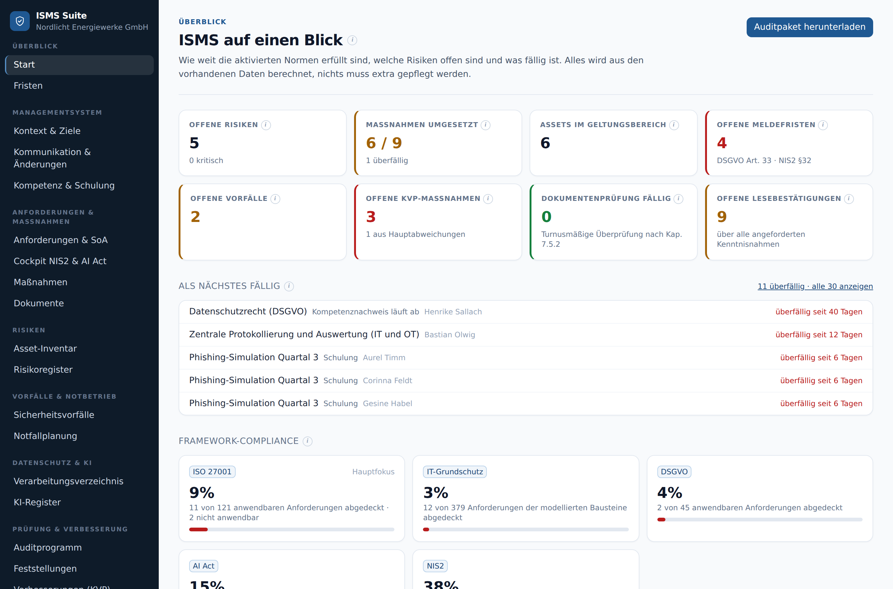
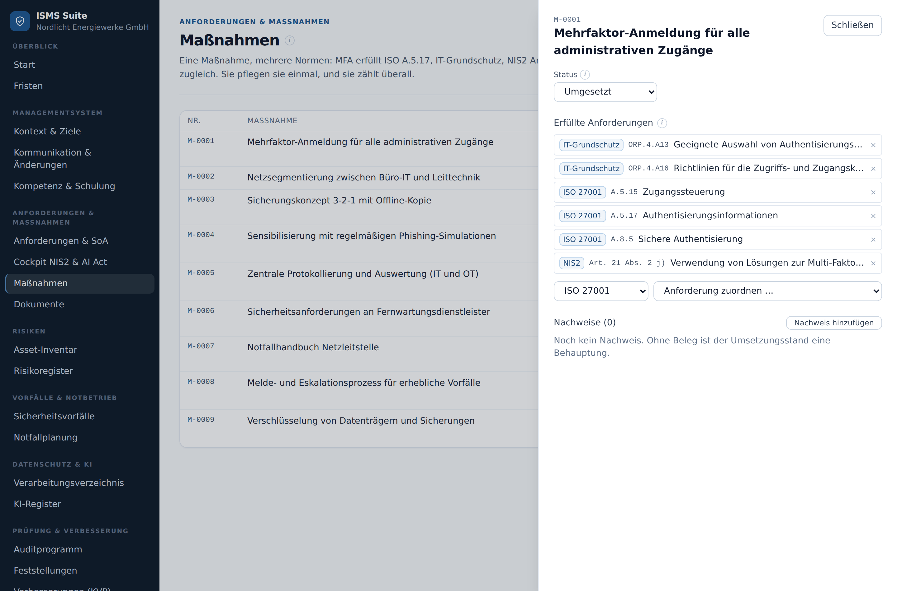

# ISMS-Suite

**Informationssicherheit, Datenschutz und NIS2 an einem Ort, ohne Excel-Listen und ohne
doppelte Pflege.**



## Worum es geht

Wer ein Informationssicherheits-Managementsystem nach **ISO 27001** betreibt, muss oft
gleichzeitig **NIS2**, die **DSGVO** und den **BSI IT-Grundschutz** erfüllen, und seit Kurzem
die Pflichten des **EU AI Act** für eingesetzte KI-Systeme. In der Praxis
landet dieselbe Maßnahme dann in vier Tabellen, und keine davon ist aktuell.

Die ISMS-Suite dreht das um: Sie erfassen eine Maßnahme **einmal**, ordnen sie den
Anforderungen zu, und sie zählt in jedem Regelwerk. Kennzahlen, Fristen und Berichte ergeben
sich aus dem, was ohnehin gepflegt wird, statt abgetippt zu werden.

**Für wen:** ISMS-Leitung und Informationssicherheitsbeauftragte, Datenschutzbeauftragte,
interne Auditorinnen und Auditoren, Fachverantwortliche für Systeme und Risiken.

## Was Sie damit tun können

### Den Überblick behalten

- **Startseite:** wie weit jedes Regelwerk umgesetzt ist, offene Risiken, was als Nächstes
  fällig wird.
- **Fristen:** jede Frist im ISMS auf einer Liste: Maßnahmen, Prüftermine,
  Meldefristen, Schulungen. Auf Wunsch als tägliche E-Mail an die Verantwortlichen.

### Einmal pflegen, mehrfach anrechnen

Eine Maßnahme wie „Mehrfaktor-Anmeldung für alle Administratoren“ erfüllt Anforderungen aus
ISO 27001, IT-Grundschutz und NIS2 zugleich. Die Suite schlägt passende Anforderungen der
anderen Regelwerke selbst vor.



Aus diesen Zuordnungen erzeugt die Suite die **Anwendbarkeitserklärung** (SoA) für die
Zertifizierung, als Liste und als druckfertiges Dokument. Für den **IT-Grundschutz** gibt es
keine SoA, sondern das, was das BSI verlangt: Sie wählen Absicherungsvariante und zutreffende
Bausteine (Modellierung), und der IT-Grundschutz-Check zeigt nur deren Anforderungen.

### Risiken steuern

Werte erfassen, Risiken mit zwei Fragen bewerten: „Wie wahrscheinlich ist es?“ und „Wie schlimm
wäre es?“ —, Maßnahmen zuordnen und ein Risiko bewusst tragen, dokumentiert und von einer zweiten
Person bestätigt. Jedes Risiko hat genau eine Bewertung: wie es heute steht.

### Vorfälle und Notfälle

- **Sicherheitsvorfälle** mit den gesetzlichen Meldefristen im Blick: NIS2 (24 Stunden,
  72 Stunden, 1 Monat), DSGVO (72 Stunden) und AI Act bei schwerwiegenden Vorfällen mit
  eingesetzten KI-Systemen.
- **Notfallplanung:** welche Prozesse wie lange ausfallen dürfen, Notfallpläne und
  Übungen.

### NIS2 auf einen Blick

Das **NIS2-Cockpit** zeigt jede Pflicht nach NIS2 und BSI-Gesetz (§ 30 BSIG und folgende), und
womit sie erfüllt ist: ISO-27001-Controls, IT-Grundschutz-Bausteine, Maßnahmen. Pflichten, die
schon durch eine umgesetzte Maßnahme an einem verknüpften Control erfüllt sind, erkennt es als
„indirekt abgedeckt“ und übernimmt die Zuordnung mit einem Klick. Als Tabelle zum Arbeiten und als
Flussdiagramm für die Präsentation.

### Datenschutz und KI

Das **Verarbeitungsverzeichnis** prüft sich selbst auf Lücken: fehlende Rechtsgrundlage,
Drittlandübermittlung ohne Garantien, fehlende Folgenabschätzung. Die technischen und
organisatorischen Maßnahmen sind dieselben wie im ISMS, keine zweite Liste.

Das **KI-Register** erfasst die KI-Systeme, die Sie einsetzen, und stuft sie nach dem EU AI Act
ein. Die Einstufung ergibt sich aus wenigen Fragen, nicht aus einer Selbsteinschätzung. Abgebildet sind **ausschließlich die
Pflichten als Betreiber**; Anbieterpflichten wie Konformitätsbewertung oder CE-Kennzeichnung nicht.

### Organisation und Menschen

- Kontext der Organisation, interessierte Parteien und Sicherheitsziele
- Kommunikationsplan, geplante Änderungen und Organigramm, samt unbesetzter Stellen
- Kompetenzen und Schulungen mit Nachweis: wer was können muss und wo es fehlt
- Dokumente mit Fassungen, Freigabe und Lesebestätigung

### Prüfen und verbessern

Interne Audits nach Kapiteln geplant, Feststellungen mit Nachweis der Behebung,
Korrekturmaßnahmen, Kennzahlen und die Managementbewertung in drei Schritten. Die Lage dafür stellt die
Suite aus den laufenden Daten zusammen.

### Bereit fürs Audit

Ein Klick auf **„Auditpaket herunterladen“** liefert eine ZIP-Datei mit allen Registern als
Excel-lesbare Tabellen und allen hinterlegten Nachweisen im Original. Für den Termin, in dem
jemand sagt: „Zeigen Sie mir Ihr ISMS.“

### Hilfe direkt am Feld

Neben jedem Eingabefeld zeigt ein kleines i, welche Anforderung dahintersteckt,
etwa „ISO 27001:2022 · Kap. 7.4 · Kommunikation“. Wer fragt, warum ein Feld Pflicht ist,
bekommt die Antwort, ohne die Norm aufschlagen zu müssen.

## Darauf können Sie sich verlassen

- **Vier-Augen-Prinzip:** Wer ein Dokument schreibt, gibt es nicht selbst frei. Wer ein Risiko
  verantwortet, übernimmt es nicht selbst. Das gilt nicht nur in der Oberfläche, sondern ist
  in der Datenbank verankert.
- **Rollen:** Jede Person sieht und bearbeitet nur, was zu ihrer Aufgabe gehört. Eine
  Auditorin prüft, ändert aber nicht das ISMS.
- **Lückenloses Änderungsprotokoll,** das auch die ISMS-Leitung nicht nachträglich glätten kann.
- **Eigener Betrieb, keine Lizenzkosten:** läuft auf einem eigenen Rechner oder Server,
  ausschließlich mit quelloffener Software.

## Selbst ausprobieren

Die Suite bringt einen vollständig ausgefüllten **Beispielmandanten** mit: die erfundene
Nordlicht Energiewerke GmbH. So lässt sich jede Funktion sofort ansehen, ohne erst Daten
einzutragen.

**Sie brauchen nur Docker Desktop** (kostenlos für Privatpersonen und kleine Unternehmen).

1. **Docker Desktop installieren**: von <https://www.docker.com/products/docker-desktop/>
   herunterladen, installieren und starten. Unter Windows richtet der Installer alles
   Nötige mit ein; danach einmal neu starten.
2. **Die Suite herunterladen**: auf GitHub oben rechts auf **Code → Download ZIP**, die Datei
   entpacken.
3. **Ein Terminal im entpackten Ordner öffnen**
   - Windows: im Ordner Rechtsklick → **Im Terminal öffnen**
   - Mac: Programm **Terminal** öffnen, `cd ` eintippen (mit Leerzeichen), den Ordner ins
     Fenster ziehen, Enter
4. **Starten:**

   ```
   docker compose up -d --build
   ```

   Beim ersten Mal dauert das einige Minuten, denn die Suite wird gebaut und mit Beispieldaten
   gefüllt. Jeder weitere Start geht in Sekunden.

5. **Im Browser öffnen:** <http://localhost:8080>
6. **Anmelden**: Kennwort für alle Konten: `demo-passwort-2026-nordlicht`

   | Anmeldung als                       | sieht die Suite als …                    |
   | ----------------------------------- | ---------------------------------------- |
   | `henrike.sallach@nordlicht.example` | ISMS-Leitung, darf fast alles            |
   | `jorin.kessler@nordlicht.example`   | Stellvertretung, gibt Dokumente frei     |
   | `bastian.olwig@nordlicht.example`   | Verantwortlicher für Systeme und Risiken |
   | `corinna.feldt@nordlicht.example`   | Interne Auditorin, prüft, ändert nicht   |
   | `ilka.norgaard@nordlicht.example`   | Datenschutzbeauftragte                   |

7. **Beenden:** `docker compose down`. Die Daten bleiben erhalten. Mit
   `docker compose down -v` wird alles verworfen; der nächste Start beginnt frisch.

### Was Sie zuerst ansehen sollten

1. **Startseite**: Umsetzungsstand je Regelwerk und was als Nächstes fällig ist.
2. **Maßnahmen →** „Mehrfaktor-Anmeldung …“ öffnen: eine Maßnahme, drei Regelwerke.
3. **Risikoregister**: die Matrix; ein Risiko öffnen und die Bewertung ansehen.
4. **Sicherheitsvorfälle**: der Fristenmonitor zeigt eine überfällige NIS2-Meldung.
5. **Cockpit NIS2 & AI Act**: jede NIS2-Pflicht mit BSIG-Paragraf und womit sie erfüllt ist;
   oben rechts auf „Flussdiagramm“ umschalten.
6. **KI-Register**: die Bewerbervorauswahl öffnen und nachsehen, warum sie noch nicht in Betrieb gehen darf.
7. **Startseite → Auditpaket herunterladen** und die ZIP-Datei öffnen.

Dann abmelden und als **Corinna Feldt** wieder anmelden: dieselbe Suite aus Sicht der
Auditorin. Sie sieht alles, ändert aber nur Audits und Feststellungen. So zeigt sich die
Funktionstrennung am deutlichsten.

Klappt etwas nicht? Die häufigsten Ursachen und ihre Lösung stehen in der
[Fehlersuche](docs/deployment.md#9-fehlersuche).

## Weiterführende Dokumentation

| Dokument                                                | Inhalt                                                              |
| ------------------------------------------------------- | ------------------------------------------------------------------- |
| [Technische Dokumentation](docs/technik.md)             | Aufbau, Entwicklungsumgebung, Tests, Demodaten, Hintergrundaufträge |
| [Deployment und Betrieb](docs/deployment.md)            | Inbetriebnahme, Konfiguration, Datensicherung, Produktivbetrieb     |
| [Architektur](docs/architecture/)                       | Datenmodell und Backend-Architektur mit Begründung                  |
| [Screenshots aller Bereiche](docs/produkt-screenshots/) | 43 Bilder der Oberfläche, mit Vorschlag für eine Vorführung         |
| [Offene Punkte](docs/offene-punkte.md)                  | Prüfaufträge und bekannte Lücken                                    |
