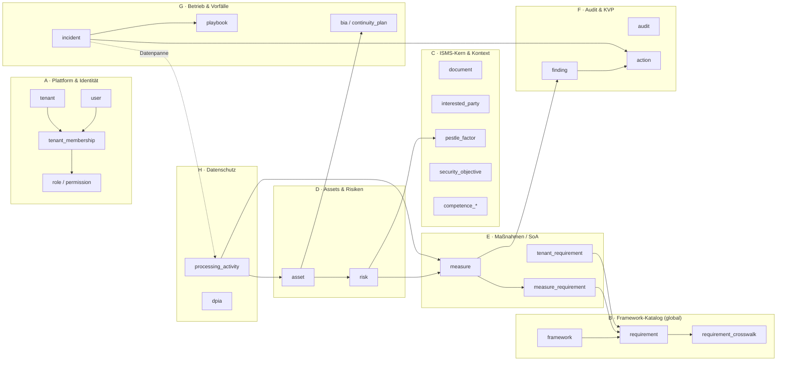
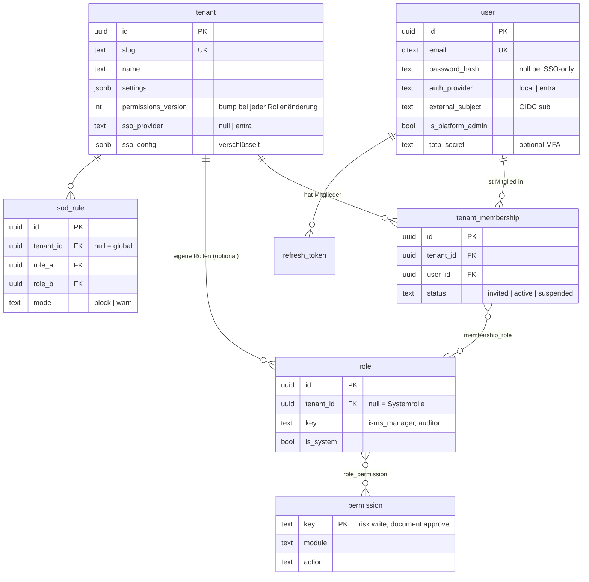
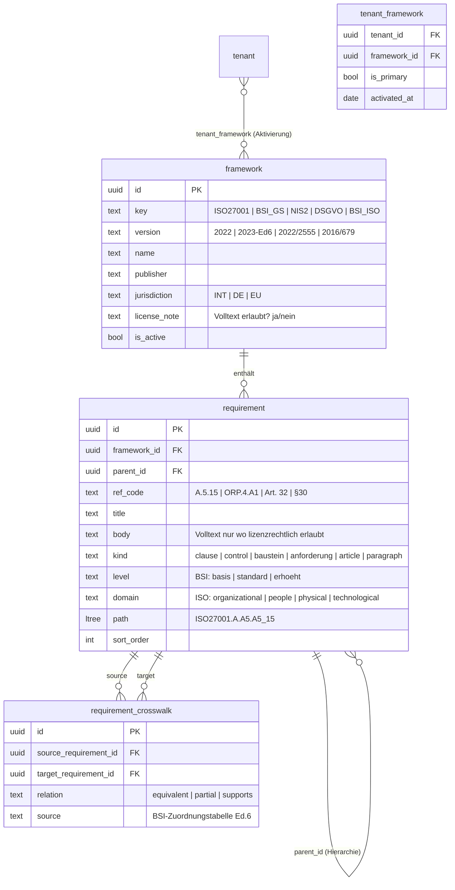
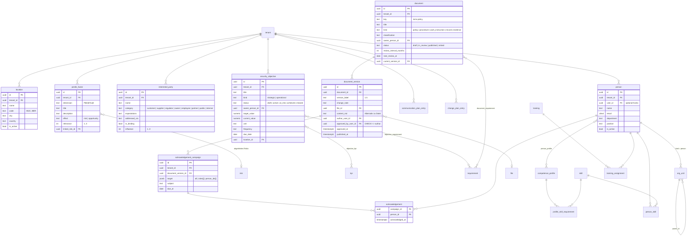
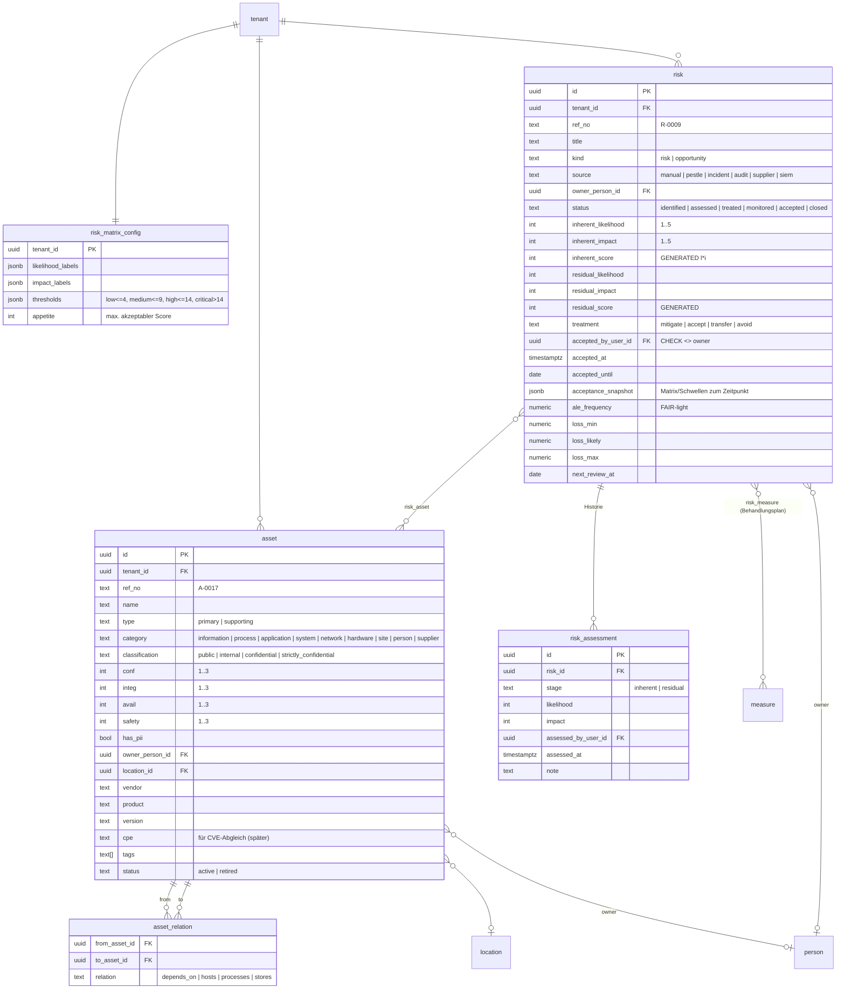
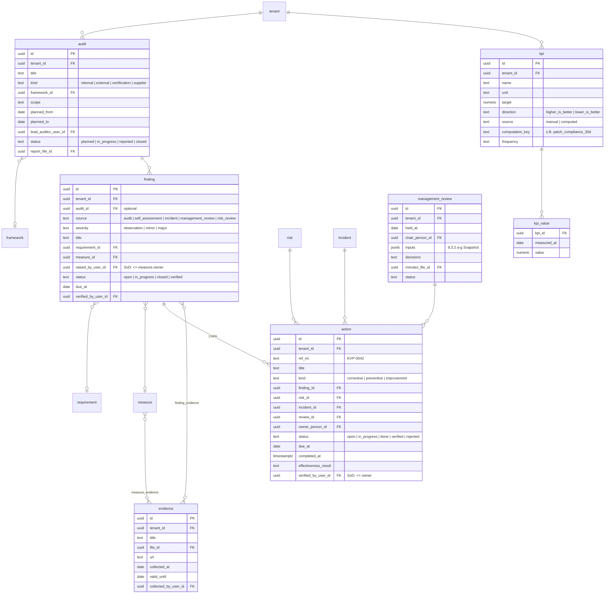
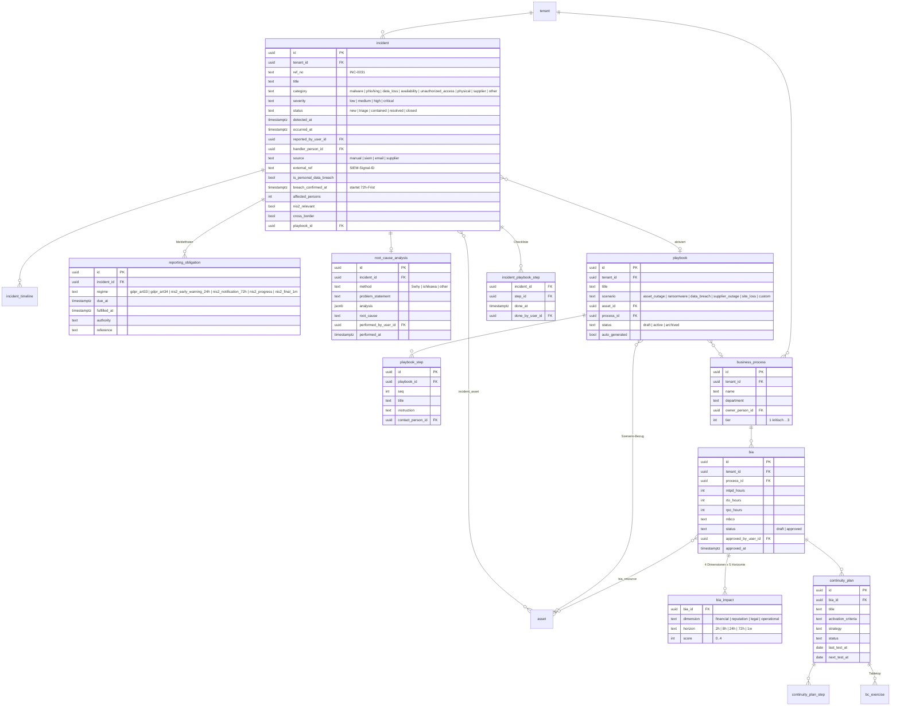
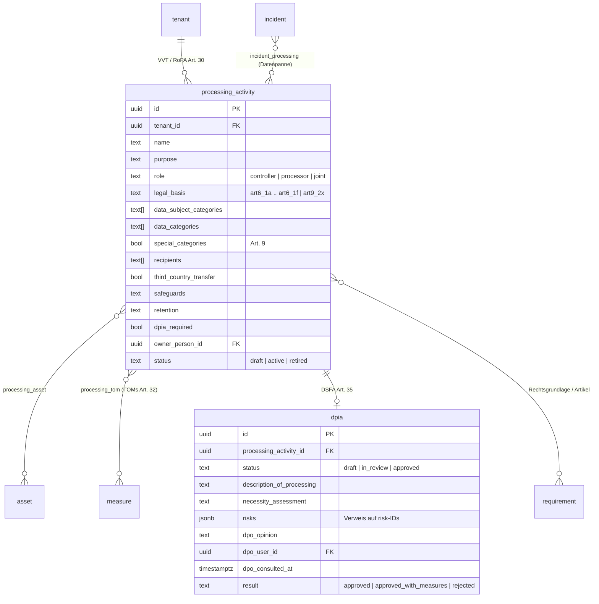
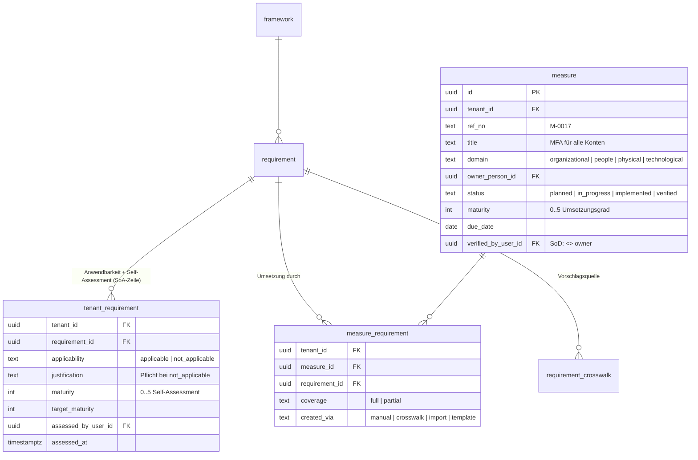

# 01 — Datenmodell (Entity-Relationship-Entwurf)

> Status: **Freigegeben (2026-09-15)** · Ziel-DB: PostgreSQL 16 (Open Source) · Stand: 2026-09-15

Dieses Dokument beschreibt das relationale Datenmodell der ISMS-SaaS-Plattform. Es ist nach
fachlichen Domänen gegliedert. Die beiden Kernfragen — **Multi-Framework-Mapping** und
**RBAC / Funktionstrennung** — werden in eigenen Kapiteln (§3 und §4) mit DDL, Beispiel-Queries
und Index-Strategie ausgeführt.

---

## 0. Leitplanken

| Prinzip | Umsetzung im Schema |
|---|---|
| **KISS** | Ein Modell, keine Event-Sourcing-/CQRS-Schichten. Historie nur dort, wo Auditoren sie brauchen (Risikobewertung, Dokumentversion, Audit-Log). |
| **Single Source of Truth** | Jede Fachtatsache existiert genau einmal. Verknüpfungen ausschließlich über Fremdschlüssel und Junction-Tabellen, keine kopierten Freitextreferenzen. |
| **Multi-Tenancy** | Jede mandantenbezogene Tabelle trägt `tenant_id`. Isolation durch **PostgreSQL Row-Level-Security** (Defense in Depth) *und* Service-Layer. |
| **Open Source / kostenneutral** | Nur Standard-PostgreSQL-Features (RLS, `ltree`, `pgcrypto`, generierte Spalten). Keine proprietären Erweiterungen. |
| **Nachvollziehbarkeit** | Append-only `audit_log` (UPDATE/DELETE per GRANT verboten). Freigaben sind Datenfelder mit `*_by`/`*_at`, nicht nur Statuswerte. |
| **Framework-Katalog ist global** | Normen/Gesetze liegen **ohne** `tenant_id` einmal vor (versioniert). Mandanten referenzieren sie, kopieren sie nicht. |

**Konventionen:** Primärschlüssel `id uuid` (UUIDv7 → zeitlich sortierbar, index-freundlich). Jede Tabelle hat `created_at`, `updated_at`; mandantenbezogene Tabellen zusätzlich `tenant_id` als **erste Spalte jedes zusammengesetzten Index**. Enums als PostgreSQL-`enum`-Typen. Kein Soft-Delete außer wo fachlich nötig (`status = 'retired'`/`'archived'`).

---

## 1. Domänenübersicht



**Die Kern-Traceability-Kette** (Anforderung aus CLAUDE.md):

```
asset ──< risk_asset >── risk ──< risk_measure >── measure ──< measure_requirement >── requirement ──> framework
```

Jede Kante ist eine echte Junction-Tabelle → in beide Richtungen navigierbar, z. B. „Welche Assets sind von Control A.8.13 betroffen?“ oder „Welche NIS2-Pflichten deckt Maßnahme M-017 mit ab?“.

---

## 2. Domänen im Detail

### A · Plattform & Identität



Wesentliche Entscheidungen:

- **`user` ist mandantenübergreifend**, `tenant_membership` bindet an einen Mandanten. Ein externer Auditor kann so in mehreren Mandanten arbeiten, ohne Mehrfachkonten.
- **`is_platform_admin`** ist ein User-Flag, keine Rolle im Mandanten. Platform-Admins erhalten ausschließlich `platform.*`-Permissions (Mandanten anlegen, SSO konfigurieren, Katalog aktualisieren) und **keine** ISMS-Daten — RLS blockt sie wie jeden Nicht-Member.
- **`permissions_version`** auf `tenant` erlaubt sofortige Rechte-Invalidierung ohne kurze JWT-Laufzeiten (Details §4.3).
- `person` (Domäne C) ist bewusst von `user` getrennt: Beschäftigte ohne Login (Kompetenzregister, Lesebestätigung, Organigramm) sind fachlich Personen, nicht Konten. `person.user_id` ist optional.

### B · Framework-Katalog (global, versioniert)



Wesentliche Entscheidungen:

- **Ein Tabellenpaar für alle Frameworks.** Norm-Klauseln (ISO Kap. 4–10), Annex-A-Controls, BSI-Bausteine/-Anforderungen, EU-Artikel und BSIG-Paragrafen sind alle `requirement`-Zeilen, unterschieden über `kind` und hierarchisiert über `parent_id` + `path` (`ltree`). Damit funktionieren Spider-Charts pro Kapitel, SoA pro Annex und Reifegrad pro Baustein mit **einer** Query-Familie.
- **„IT-Grundschutz auf Basis ISO 27001“** ist kein eigener Katalog, sondern eine *Sicht*: ISO 27001 aktiviert + BSI-Kompendium aktiviert + Crosswalk. Das Framework `BSI_ISO` existiert nur als Marker in `tenant_framework`, um diese Sicht (und die entsprechenden Reports) einzuschalten.
- **Crosswalk wird global gepflegt und aus der BSI-Zuordnungstabelle (`docs/context/Zuordnung_ISO_und_IT_Grundschutz_Edit_6.pdf`) geseedet.** Er ist gerichtet gespeichert (wie veröffentlicht: ISO → BSI) und über eine View `v_crosswalk` bidirektional abfragbar. Mandanten können eigene Crosswalk-Einträge **nicht** anlegen (SSoT); sie mappen stattdessen ihre Maßnahmen direkt (§3).
- **Lizenz-Hinweis:** Der DIN-EN-ISO-Normtext ist urheberrechtlich geschützt. Für ISO 27001 werden nur `ref_code` + Kurztitel gespeichert (`body = NULL`). BSI-Kompendium, NIS2 und DSGVO sind frei nutzbar → Volltext erlaubt. `framework.license_note` dokumentiert das.
- **Versionierung:** Eine neue Normversion = neues `framework` + neue `requirement`-Zeilen. Bestehende Mandanten-Mappings bleiben auf der alten Version gültig; ein Migrations-Assistent nutzt den Crosswalk `alt → neu` (gleiche Tabelle, `source = 'version-migration'`).

### C · ISMS-Kern & Kontext



Wesentliche Entscheidungen:

- **Dokumentenlenkung = `document` (Stammdaten) + `document_version` (unveränderlich nach Freigabe).** „Richtlinien“ (Screenshot) sind keine eigene Tabelle, sondern `document.kind = 'policy'` — genau wie im Referenz-UI („gefilterte Sicht der Dokumentenlenkung“).
- **Lesebestätigung** ist eine Kampagne pro Dokumentversion; die Zielgruppe wird bei Erstellung in konkrete `acknowledgement`-Zeilen aufgelöst (eine pro Person), damit „wer fehlt noch“ eine triviale Query ist und Nachzügler per Job ergänzt werden können.
- **Kompetenzregister** folgt dem Referenz-UI: Rollenprofile mit geforderten Skill-Levels, Ist-Levels je Person, Lücken = View `v_skill_gap` (Soll − Ist je Person/Profil).
- `communication_plan_entry` und `change_plan_entry` sind bewusst flache Tabellen (ISO 7.4 / 6.3) — kein Overengineering, aber auditierbar.

### D · Assets & Risiken



Wesentliche Entscheidungen:

- **Inhärent/Residual als Spalten auf `risk` (aktueller Stand) + `risk_assessment` (Historie).** Dashboards lesen die Spalten (schnell), Trend-Charts die Historie. Score ist `GENERATED ALWAYS AS (likelihood * impact) STORED` → Matrix-Aggregation ist ein `GROUP BY`.
- **Restrisiko-Übernahme friert die Bewertungsbasis ein** (`acceptance_snapshot`), damit eine spätere Matrix-Änderung die Freigabe nicht stillschweigend verändert (Referenz-UI: „Akzeptanzkriterium zum Zeitpunkt der Freigabe eingefroren“).
- **Lieferanten, Standorte, Personen sind Asset-Kategorien**, keine eigenen Tabellen. Das hält BIA-Abhängigkeiten (§G) und Risiko-Zuordnung einheitlich. Ein vollwertiges Lieferantenmanagement (Self-Assessments, AVV-Register) ist eine spätere Erweiterung, die `asset.category = 'supplier'` um eine 1:1-Tabelle `supplier_profile` ergänzt.
- `asset.cpe` und `vendor/product/version` sind vorbereitet für einen späteren CVE/KEV-Abgleich (Threat-Intelligence-Modul), aber im MVP nur Stammdaten.

### E · Maßnahmen & Statement of Applicability — siehe §3

### F · Audit, Findings & KVP



- **`action` ist das KVP-Register** (CAPA). Es hat *nullable* Herkunfts-FKs (`finding_id`, `risk_id`, `incident_id`, `review_id`) mit `CHECK (num_nonnulls(...) <= 1)` — jede Maßnahme kennt ihren Auslöser, ohne polymorphe Tabellen.
- **`kpi.source = 'computed'`** verweist auf einen Berechnungsschlüssel im Backend (z. B. Awareness-Completion-Rate); `kpi_value` speichert Zeitreihen für beide Quellen einheitlich.
- **Evidenzen** werden über explizite Junctions (`measure_evidence`, `finding_evidence`) gebunden — kein generisches `(entity_type, entity_id)` ohne FK.

### G · Betrieb, Vorfälle & Business Continuity



- **Meldefristen als Tabelle, nicht als Spaltenfriedhof.** Bestätigt der Handler eine Datenpanne, erzeugt das Backend die `reporting_obligation`-Zeilen (Art. 33: +72 h; NIS2: +24 h / +72 h / +1 Monat) — Fristenlogik in einer Stelle, Erinnerungen als Job, Dashboard-Query trivial (`due_at < now() AND fulfilled_at IS NULL`).
- **Interaktive Playbooks:** `playbook_step` ist die Vorlage, `incident_playbook_step` die abgehakte Checkliste je Vorfall. Auto-Generierung (Referenz-UI) erzeugt aus Tier-1-Prozessen und kritischen Assets Entwürfe mit `auto_generated = true`.
- **BIA normalisiert** (`bia_impact` 4 × 5 Zellen) statt JSON — erlaubt „alle Prozesse mit finanziellem Schaden ≥ 3 nach 24 h“ als Query. BIA-Ressourcen sind Assets (inkl. Lieferanten/Standorte/Schlüsselpersonen).

### H · Datenschutz (DSB)



- **TOMs sind Maßnahmen.** `processing_tom` verknüpft Verarbeitungstätigkeiten mit denselben `measure`-Zeilen, die auch ISO/BSI-Controls erfüllen — die DSGVO-Art.-32-Abdeckung fällt damit aus dem Multi-Mapping heraus, ohne doppelte Pflege.
- Datenpannen sind `incident`s mit `is_personal_data_breach = true`; Betroffenenrechte-Anfragen (DSAR) sind eine spätere Erweiterung.

### I · Querschnitt

| Tabelle | Zweck | Besonderheit |
|---|---|---|
| `file` | Blob-Metadaten (Storage-Key, MIME, SHA-256, Größe, Uploader) | Bytes liegen im Storage-Adapter (lokal/MinIO/Azure Blob), nie in Postgres. |
| `audit_log` | Append-only Protokoll (wer, wann, was, Diff) | `REVOKE UPDATE, DELETE` für die App-Rolle; BRIN-Index auf `at`; Partitionierung pro Monat ab ~10 Mio Zeilen. |
| `notification` | In-App-Benachrichtigungen + E-Mail-Outbox | Jobs lesen unversendete Zeilen; idempotent. |
| `integration` / `integration_event` | Vorbereitung SIEM/Sentinel-Anbindung | Rohereignis → gemappter `incident`. Secrets per `pgcrypto` mit App-Key verschlüsselt. |
| `sequence_counter` | Fortlaufende `ref_no` je Mandant und Typ (R-0009, INC-0031) | `UPDATE … RETURNING` in derselben Transaktion → lückenlos, ohne Race. |

---

## 3. Multi-Framework-Mapping (Kernmechanik)

### 3.1 Drei Tabellen, klare Verantwortung



| Frage | Beantwortet durch |
|---|---|
| Gilt Control X für uns? Warum nicht? | `tenant_requirement.applicability`, `justification` |
| Wie reif sind wir bei Control X (Selbsteinschätzung)? | `tenant_requirement.maturity` |
| **Welche konkreten Maßnahmen erfüllen X — und welche anderen Anforderungen erfüllen sie gleichzeitig?** | `measure_requirement` (n:m) |
| Wenn ich X aus ISO mappe, welche BSI-/NIS2-Anforderungen sind wahrscheinlich mit abgedeckt? | `requirement_crosswalk` → Vorschlag, wird bei Bestätigung zu `measure_requirement` (`created_via = 'crosswalk'`) |

Die **SoA** ist damit **keine eigene Tabelle**, sondern eine View über `requirement ⟕ tenant_requirement ⟕ measure_requirement` — pro aktiviertem Framework. Es gibt nichts, was doppelt gepflegt werden könnte.

### 3.2 DDL (Auszug)

```sql
-- Globaler Katalog (kein tenant_id, kein RLS)
CREATE TABLE framework (
  id            uuid PRIMARY KEY,
  key           text NOT NULL,            -- 'ISO27001','BSI_GS','NIS2','DSGVO','BSI_ISO'
  version       text NOT NULL,            -- '2022','2023-Ed6','2022/2555','2016/679'
  name          text NOT NULL,
  publisher     text,
  jurisdiction  text,
  license_note  text,
  is_active     boolean NOT NULL DEFAULT true,
  UNIQUE (key, version)
);

CREATE TABLE requirement (
  id            uuid PRIMARY KEY,
  framework_id  uuid NOT NULL REFERENCES framework(id),
  parent_id     uuid REFERENCES requirement(id),
  ref_code      text NOT NULL,            -- 'A.5.15','ORP.4.A1','Art. 32','§30 Abs. 2 Nr. 10'
  title         text NOT NULL,
  body          text,                     -- NULL wo lizenzrechtlich nicht erlaubt (ISO)
  kind          requirement_kind NOT NULL,-- clause|control|baustein|anforderung|article|paragraph
  level         text,                     -- BSI: basis|standard|erhoeht
  domain        text,                     -- ISO 27002 Themen; für Spider-Charts
  path          ltree NOT NULL,           -- 'ISO27001.A.A5.A5_15'
  sort_order    int NOT NULL,
  UNIQUE (framework_id, ref_code)
);
CREATE INDEX requirement_path_gist ON requirement USING gist (path);
CREATE INDEX requirement_fw_kind   ON requirement (framework_id, kind, sort_order);

CREATE TABLE requirement_crosswalk (
  id                     uuid PRIMARY KEY,
  source_requirement_id  uuid NOT NULL REFERENCES requirement(id),
  target_requirement_id  uuid NOT NULL REFERENCES requirement(id),
  relation               text NOT NULL CHECK (relation IN ('equivalent','partial','supports')),
  source                 text NOT NULL,   -- 'BSI-Zuordnungstabelle Ed.6', 'version-migration'
  UNIQUE (source_requirement_id, target_requirement_id),
  CHECK (source_requirement_id <> target_requirement_id)
);
CREATE INDEX crosswalk_target ON requirement_crosswalk (target_requirement_id);

CREATE VIEW v_crosswalk AS               -- bidirektional abfragbar
  SELECT source_requirement_id AS from_id, target_requirement_id AS to_id, relation, source FROM requirement_crosswalk
  UNION ALL
  SELECT target_requirement_id, source_requirement_id, relation, source FROM requirement_crosswalk;

-- Mandantenbezogen (RLS aktiv)
CREATE TABLE tenant_requirement (
  tenant_id            uuid NOT NULL REFERENCES tenant(id),
  requirement_id       uuid NOT NULL REFERENCES requirement(id),
  applicability        text NOT NULL DEFAULT 'applicable' CHECK (applicability IN ('applicable','not_applicable')),
  justification        text,
  maturity             smallint CHECK (maturity BETWEEN 0 AND 5),
  target_maturity      smallint CHECK (target_maturity BETWEEN 0 AND 5),
  assessed_by_user_id  uuid REFERENCES "user"(id),
  assessed_at          timestamptz,
  PRIMARY KEY (tenant_id, requirement_id),
  CHECK (applicability = 'applicable' OR justification IS NOT NULL)   -- SoA-Pflicht
);

CREATE TABLE measure (
  id                   uuid PRIMARY KEY,
  tenant_id            uuid NOT NULL REFERENCES tenant(id),
  ref_no               text NOT NULL,
  title                text NOT NULL,
  description          text,
  domain               text,
  owner_person_id      uuid REFERENCES person(id),
  status               measure_status NOT NULL DEFAULT 'planned',
  maturity             smallint CHECK (maturity BETWEEN 0 AND 5),
  due_date             date,
  verified_by_user_id  uuid REFERENCES "user"(id),
  verified_at          timestamptz,
  UNIQUE (tenant_id, ref_no)
);
CREATE INDEX measure_tenant_status ON measure (tenant_id, status);

CREATE TABLE measure_requirement (
  tenant_id       uuid NOT NULL REFERENCES tenant(id),
  measure_id      uuid NOT NULL REFERENCES measure(id) ON DELETE CASCADE,
  requirement_id  uuid NOT NULL REFERENCES requirement(id),
  coverage        text NOT NULL DEFAULT 'full' CHECK (coverage IN ('full','partial')),
  created_via     text NOT NULL DEFAULT 'manual',
  PRIMARY KEY (measure_id, requirement_id)
);
-- Der entscheidende Index für SoA-/Coverage-Queries: "alle Maßnahmen zu Anforderung X in Mandant T"
CREATE INDEX measure_requirement_by_req ON measure_requirement (tenant_id, requirement_id) INCLUDE (measure_id, coverage);
```

### 3.3 Die vier Standard-Queries

**(a) SoA / Anforderungsregister eines Frameworks** — eine Zeile je Control, mit Anwendbarkeit, Reife und Anzahl/Status der Maßnahmen:

```sql
SELECT r.ref_code, r.title, r.domain,
       COALESCE(tr.applicability, 'applicable')                    AS applicability,
       tr.justification, tr.maturity, tr.target_maturity,
       COUNT(mr.measure_id)                                         AS measure_count,
       COUNT(mr.measure_id) FILTER (WHERE m.status IN ('implemented','verified')) AS implemented_count,
       MAX(m.maturity)                                              AS best_measure_maturity
FROM requirement r
LEFT JOIN tenant_requirement  tr ON tr.requirement_id = r.id AND tr.tenant_id = :tenant
LEFT JOIN measure_requirement mr ON mr.requirement_id = r.id AND mr.tenant_id = :tenant
LEFT JOIN measure             m  ON m.id = mr.measure_id
WHERE r.framework_id = :framework AND r.kind = 'control'
GROUP BY r.id, tr.applicability, tr.justification, tr.maturity, tr.target_maturity
ORDER BY r.sort_order;
```

**(b) Framework-Compliance-Kachel (Dashboard, „70 % ISO / 38 % BSI / 7 % NIS2“)** — Anteil anwendbarer Anforderungen mit mindestens einer umgesetzten Maßnahme, pro aktiviertem Framework in **einer** Query:

```sql
SELECT f.key, f.name,
       COUNT(*) FILTER (WHERE COALESCE(tr.applicability,'applicable') = 'applicable')                 AS applicable,
       COUNT(*) FILTER (WHERE COALESCE(tr.applicability,'applicable') = 'applicable' AND cov.ok)      AS covered,
       ROUND(100.0 * COUNT(*) FILTER (WHERE cov.ok) / NULLIF(COUNT(*) FILTER (WHERE COALESCE(tr.applicability,'applicable')='applicable'),0), 0) AS pct
FROM tenant_framework tf
JOIN framework   f ON f.id = tf.framework_id
JOIN requirement r ON r.framework_id = f.id AND r.kind IN ('control','anforderung','article','paragraph')
LEFT JOIN tenant_requirement tr ON tr.requirement_id = r.id AND tr.tenant_id = tf.tenant_id
LEFT JOIN LATERAL (
  SELECT EXISTS (
    SELECT 1 FROM measure_requirement mr JOIN measure m ON m.id = mr.measure_id
    WHERE mr.tenant_id = tf.tenant_id AND mr.requirement_id = r.id AND m.status IN ('implemented','verified')
  ) AS ok
) cov ON true
WHERE tf.tenant_id = :tenant
GROUP BY f.id;
```

**(c) Crosswalk-Vorschlag beim Mapping** — Nutzer verknüpft Maßnahme M mit ISO A.5.15; das System schlägt die BSI-/NIS2-Pendants vor, die (1) in einem aktivierten Framework liegen und (2) noch nicht gemappt sind:

```sql
SELECT t.id, f.key AS framework, t.ref_code, t.title, x.relation
FROM v_crosswalk x
JOIN requirement t ON t.id = x.to_id
JOIN framework   f ON f.id = t.framework_id
JOIN tenant_framework tf ON tf.framework_id = f.id AND tf.tenant_id = :tenant
WHERE x.from_id = :requirement
  AND NOT EXISTS (SELECT 1 FROM measure_requirement mr WHERE mr.measure_id = :measure AND mr.requirement_id = t.id)
ORDER BY x.relation = 'equivalent' DESC, f.key, t.sort_order;
```

**(d) Traceability-Kette** — „Was hängt an Asset A?“ bis zur Norm:

```sql
SELECT a.ref_no AS asset, r.ref_no AS risk, m.ref_no AS measure, f.key AS framework, q.ref_code
FROM asset a
JOIN risk_asset          ra ON ra.asset_id = a.id
JOIN risk                r  ON r.id = ra.risk_id
JOIN risk_measure        rm ON rm.risk_id = r.id
JOIN measure             m  ON m.id = rm.measure_id
JOIN measure_requirement mr ON mr.measure_id = m.id
JOIN requirement         q  ON q.id = mr.requirement_id
JOIN framework           f  ON f.id = q.framework_id
WHERE a.tenant_id = :tenant AND a.id = :asset
ORDER BY r.ref_no, m.ref_no, f.key, q.sort_order;
```

### 3.4 Performance-Einschätzung

Die Mengengerüste sind klein und gut abschätzbar: ISO 27001 ≈ 130 Zeilen (Klauseln + 93 Controls), BSI-Kompendium ≈ 1 500 Anforderungen in 111 Bausteinen, NIS2 + BSIG ≈ 80, DSGVO ≈ 100. Ein Mandant hat typischerweise 50–500 Maßnahmen und 200–3 000 `measure_requirement`-Zeilen. Alle vier Queries treffen mit den oben definierten Indizes auf Index-Scans mit wenigen tausend Zeilen — **kein Caching, keine Materialisierung im MVP nötig**. Sollte das Dashboard bei sehr großen Mandanten (>10 k Mappings) spürbar werden, ist der vorgesehene Schritt eine `MATERIALIZED VIEW mv_framework_coverage`, die per Job nach Änderungen an `measure`/`measure_requirement`/`tenant_requirement` aufgefrischt wird (Hook im Backend, kein Trigger-Zoo).

### 3.5 Seeding des Katalogs

| Framework | Quelle in `docs/context/` | Volltext | Umfang |
|---|---|---|---|
| ISO/IEC 27001:2022 | `DIN EN ISO_IEC 27001_2024-01.PDF` | **nein** (DIN-Urheberrecht) — nur `ref_code` + Kurztitel | Kap. 4–10 (≈ 40 Klauseln) + Annex A (93 Controls, 4 Domänen) |
| BSI IT-Grundschutz Kompendium Ed. 2023 | `IT_Grundschutz_Kompendium_Edition2023.pdf` | ja | 111 Bausteine, ≈ 1 500 Anforderungen mit Level basis/standard/erhöht |
| BSI-Standards 200-1…4 | `standard_200_*.pdf` | ja (Kapitel als `clause`) | für die Zuordnungstabelle referenzierte Kapitel |
| NIS2 | `NIS2.pdf` | ja | Art. 20–23 (+ 21 Abs. 2 a–j als Einzelanforderungen); BSIG-§§ (NIS2UmsuCG) werden nachgezogen, sobald verkündet |
| DSGVO | `DSGVO.pdf` | ja | Art. 5, 24–39 und Kapitel III (Betroffenenrechte) als Anforderungen |
| Crosswalk ISO ↔ BSI | `Zuordnung_ISO_und_IT_Grundschutz_Edit_6.pdf` | — | ≈ 600 gerichtete Zuordnungen; zusätzlich ein kuratierter Crosswalk ISO ↔ NIS2 Art. 21 ↔ DSGVO Art. 32 (kleine Menge, manuell gepflegt) |

Die Seeds liegen als JSON im Repo (`packages/catalog/`), werden per Migration-Job idempotent eingespielt (`UPSERT ON (framework_id, ref_code)`) und sind damit versionierbar und reviewbar.

---

## 4. RBAC & Funktionstrennung

### 4.1 Rollenmodell

Rechte sind **feingranulare Permissions** (`<modul>.<aktion>`), Rollen sind Bündel davon. Fünf Systemrollen sind vordefiniert (`role.is_system = true`, `tenant_id = NULL`); Mandanten können sie kopieren und anpassen, nicht editieren.

| Modul → Aktion | Platform Admin | ISMS-Manager / CISO | Asset-/Risk-Owner | Auditor | DSB |
|---|:-:|:-:|:-:|:-:|:-:|
| `platform.*` (Mandanten, SSO, Katalog-Update) | ● | – | – | – | – |
| `tenant.settings`, `tenant.members`, `tenant.roles` | – | ● | – | – | – |
| `framework.activate` | – | ● | – | – | – |
| `context.*` (Parteien, PESTLE, Ziele, Standorte, Org) | – | ● | ○ read | ○ read | ○ read |
| `asset.read` / `asset.write` / `asset.write_own` | – | ● / ● / – | ● / – / ● | ● / – / – | ● / – / – |
| `risk.read` / `risk.write` / `risk.write_own` / `risk.accept` | – | ● / ● / – / ● | ● / – / ● / – | ● / – / – / – | ● / – / – / – |
| `measure.read` / `measure.write` / `measure.write_own` / `measure.verify` | – | ● / ● / – / ● | ● / – / ● / – | ● / – / – / – | ● / – / – / – |
| `soa.read` / `soa.write` | – | ● / ● | ○ read | ○ read | ○ read |
| `document.read` / `.write` / `.approve` / `.publish` | – | ● / ● / ● / ● | ● / – / – / – | ● / – / – / – | ● / ● (privacy) / – / – |
| `competence.*`, `training.*` | – | ● | ○ read | ○ read | ○ read |
| `audit.read` / `audit.write` / `finding.write` / `finding.verify` | – | ● / ● (plan) / – / – | ○ read / – / – / – | ● / ● / ● / ● | ○ read |
| `action.read` / `action.write` / `action.write_own` / `action.verify` | – | ● / ● / – / ● | ● / – / ● / – | ● / – / – / ● | ● / – / ● / – |
| `incident.read` / `incident.write` / `incident.report` | – | ● / ● / ● | ○ read / ● (melden) / – | ○ read | ● / ● / ● (Datenpanne) |
| `continuity.*` (BIA, BCP, Playbooks) | – | ● | ○ read / write_own | ○ read | ○ read |
| `privacy.*` (VVT, DSFA) | – | ○ read | – | ○ read | ● |
| `report.export` | – | ● | – | ● | ● |
| `auditlog.read` | – | ● | – | ● | ● |

● = voll · ○ = eingeschränkt · – = kein Zugriff. Die Matrix ist als Seed-Datei (`packages/shared/permissions.ts`) im Code, damit Backend-Guards, Frontend-Menüs und Tests dieselbe Quelle nutzen.

**Scoped Write (`*.write_own`)** ist keine Rolle, sondern eine Permission, deren Prüfung zusätzlich `owner_person_id = <person des Aufrufers>` verlangt (§4.4). Damit kann ein Risk-Owner *seine* Risiken pflegen, ohne dass für jede Zuweisung Rollen verändert werden müssen.

### 4.2 Schema

```sql
CREATE TABLE permission (
  key     text PRIMARY KEY,           -- 'risk.write_own'
  module  text NOT NULL,
  action  text NOT NULL,
  description text
);

CREATE TABLE role (
  id         uuid PRIMARY KEY,
  tenant_id  uuid REFERENCES tenant(id),        -- NULL = Systemrolle
  key        text NOT NULL,                      -- 'isms_manager'
  name       text NOT NULL,
  is_system  boolean NOT NULL DEFAULT false,
  UNIQUE (tenant_id, key)
);

CREATE TABLE role_permission (
  role_id        uuid REFERENCES role(id) ON DELETE CASCADE,
  permission_key text REFERENCES permission(key),
  PRIMARY KEY (role_id, permission_key)
);

CREATE TABLE membership_role (
  membership_id uuid REFERENCES tenant_membership(id) ON DELETE CASCADE,
  role_id       uuid REFERENCES role(id),
  PRIMARY KEY (membership_id, role_id)
);

-- Statische Funktionstrennung: unvereinbare Rollenpaare
CREATE TABLE sod_rule (
  id        uuid PRIMARY KEY,
  tenant_id uuid REFERENCES tenant(id),          -- NULL = global
  role_a    uuid NOT NULL REFERENCES role(id),
  role_b    uuid NOT NULL REFERENCES role(id),
  mode      text NOT NULL CHECK (mode IN ('block','warn')),
  reason    text,
  CHECK (role_a < role_b)                         -- kanonische Reihenfolge, keine Duplikate
);
```

Globale Seeds für `sod_rule`:

| Rolle A | Rolle B | Modus | Grund |
|---|---|---|---|
| Auditor | ISMS-Manager | block | Auditor darf das ISMS nicht selbst betreiben (ISO 9.2.2 c: Unparteilichkeit) |
| Auditor | Asset-/Risk-Owner | block | Auditor darf nicht die eigene Umsetzung prüfen |
| DSB | ISMS-Manager | warn | Art. 38 Abs. 6 DSGVO: Interessenkonflikt möglich, in KMU aber üblich → Warnung + Dokumentation |

### 4.3 Effektive Rechte: Auflösung und Caching

```sql
-- Effektive Permissions einer Mitgliedschaft (1 Query, 2 Joins, alle Spalten indiziert)
SELECT DISTINCT rp.permission_key
FROM membership_role mr
JOIN role_permission rp ON rp.role_id = mr.role_id
WHERE mr.membership_id = :membership;
```

Ablauf pro Request:

1. **Login** → Access-JWT (15 min) enthält `sub`, `membership_id`, `tenant_id`, `person_id` und `pv` (= `tenant.permissions_version` zum Login-Zeitpunkt). Die Permission-Liste selbst steht **nicht** im Token.
2. **Guard** liest das effektive Permission-Set aus einem In-Memory-Cache (`Map<membership_id, {pv, Set<permission>}>`, TTL 5 min).
3. Bei **Cache-Miss oder `pv`-Mismatch** wird die Query oben ausgeführt (Sub-Millisekunde, Primärschlüssel-Joins).
4. Jede Rollenänderung im Mandanten führt `UPDATE tenant SET permissions_version = permissions_version + 1` aus → alle Sessions des Mandanten holen beim nächsten Request frische Rechte. **Rechteentzug wirkt sofort**, ohne Token-Blacklist und ohne kurze Token-Laufzeiten.

Bei mehreren API-Instanzen ist der Cache pro Instanz — das ist unproblematisch, weil `pv` die Konsistenz garantiert; ein Redis ist nicht erforderlich.

### 4.4 Dynamische Funktionstrennung (Vier-Augen-Prinzip)

Statische Rollenkonflikte (§4.2) reichen nicht: Ein ISMS-Manager darf Dokumente freigeben — aber nicht sein eigenes. Diese Regeln werden **primär im Service-Layer** geprüft (klare Fehlermeldung) und **zusätzlich in der DB** abgesichert:

| Regel | Absicherung |
|---|---|
| Dokumentfreigabe ≠ Autor | `CHECK (approved_by_user_id IS DISTINCT FROM author_user_id)` auf `document_version` |
| Restrisiko-Übernahme ≠ Risk-Owner | Trigger `BEFORE UPDATE OF accepted_by_user_id ON risk` (Vergleich über `person.user_id`) |
| Maßnahme verifizieren ≠ Maßnahmen-Owner | Trigger auf `measure` |
| Finding erheben ≠ Owner der geprüften Maßnahme | Trigger auf `finding` (`raised_by` vs. `measure.owner_person_id`) |
| KVP-Wirksamkeit bestätigen ≠ KVP-Owner | Trigger auf `action` |
| Auditor auf Audit-Objekt, das er selbst verantwortet | Service-Prüfung beim Anlegen des Audits (Auditor darf kein Owner von Assets/Maßnahmen im Scope sein) |

Alle Trigger nutzen eine gemeinsame Funktion `assert_distinct_actor(actor_user_id, owner_person_id)`; sie werfen `SQLSTATE '23514'` mit sprechender Meldung, die das Backend 1:1 als `409 SoD violation` an die UI weitergibt.

### 4.5 Mandanten-Isolation via Row-Level-Security

```sql
-- Einmal pro mandantenbezogener Tabelle (per Migration-Helfer generiert)
ALTER TABLE risk ENABLE ROW LEVEL SECURITY;
ALTER TABLE risk FORCE  ROW LEVEL SECURITY;              -- gilt auch für Tabellen-Owner
CREATE POLICY tenant_isolation ON risk
  USING      (tenant_id = current_setting('app.tenant_id', true)::uuid)
  WITH CHECK (tenant_id = current_setting('app.tenant_id', true)::uuid);
```

- Die API verbindet sich als DB-Rolle `app_rw` (kein Superuser, kein `BYPASSRLS`). Migrationen laufen als `app_migrator`.
- Jede Request-Transaktion beginnt mit `SET LOCAL app.tenant_id = '<uuid>'` (aus dem JWT). Fehlt die Einstellung, liefert `current_setting(..., true)` NULL → **keine Zeile sichtbar**. Ein vergessener `WHERE tenant_id = …` im Code kann damit keine Fremddaten leaken.
- Katalogtabellen (`framework`, `requirement`, `requirement_crosswalk`, `permission`) haben kein RLS — sie sind bewusst global lesbar.
- Platform-Admin-Operationen laufen ohne `app.tenant_id` und sehen dadurch **keine** ISMS-Daten; „Support-Zugriff“ auf einen Mandanten erfordert eine explizite, im `audit_log` protokollierte, zeitlich befristete Mitgliedschaft (Break-Glass).

### 4.6 Ownership-Scoping im Service

```ts
// Pseudocode Policy-Helper (packages/shared)
can(ctx, 'risk.write', risk) =
     ctx.permissions.has('risk.write')
  || (ctx.permissions.has('risk.write_own') && risk.owner_person_id === ctx.person_id)
```

Der Helper wird im Backend-Guard **und** im Frontend (für Button-Sichtbarkeit) verwendet — gleiche Funktion, gleiche Permission-Konstanten aus `packages/shared`.

---

## 5. Index- und Constraint-Strategie (Zusammenfassung)

| Muster | Regel |
|---|---|
| Mandantentabellen | Jeder Sekundärindex beginnt mit `tenant_id` (Partition-Pruning-Effekt bei RLS). |
| Junctions | Composite-PK `(a_id, b_id)` + Gegenindex `(tenant_id, b_id)` für die Rückrichtung. |
| Hierarchien | `requirement.path ltree` (GiST) statt rekursiver CTEs für Kapitel-Aggregationen. |
| Zeitreihen | `kpi_value (kpi_id, measured_at)`, `risk_assessment (risk_id, assessed_at DESC)`, `audit_log` BRIN auf `at`. |
| Fristen | Partieller Index `reporting_obligation (due_at) WHERE fulfilled_at IS NULL`; analog `document (next_review_at)`, `action (due_at) WHERE status NOT IN ('done','verified')`. |
| Generierte Spalten | `risk.inherent_score`, `risk.residual_score` (`STORED`) → indexierbar, GROUP BY für Matrix. |
| Referenznummern | `sequence_counter (tenant_id, kind)` mit `UPDATE … RETURNING` in derselben Transaktion. |
| Volltextsuche | `tsvector`-Spalte (`GENERATED`) + GIN auf `asset`, `risk`, `measure`, `document`, `incident` — globale Suche ohne Elasticsearch. |

---

## 6. Freigabe-Entscheidungen (2026-09-15)

| # | Punkt | Entscheidung |
|---|---|---|
| 1 | Reifegradskala | **0–5** für `tenant_requirement.maturity` und `measure.maturity`; UI darf gröber darstellen. |
| 2 | Risikomatrix | **Fest 5×5.** `risk_matrix_config` hält nur Labels, Schwellen und Risikoappetit; keine `size`-Spalte. Scores 1–25. |
| 3 | ISO-Volltext | **Nur `ref_code` + Kurztitel** (DIN-Urheberrecht). `requirement.body` bleibt für ISO `NULL`. |
| 4 | Lieferantenmanagement | MVP: **Asset-Kategorie `supplier`**. Eigenes Modul (Self-Assessments, AVV-Register) in Phase 2. |
| 5 | DSAR | **Phase 2.** Keine `data_subject_request`-Tabelle im MVP. |

Das Schema ist damit freigegeben; die Umsetzung als Drizzle-Schema + SQL-Migrationen liegt in `packages/db`.
