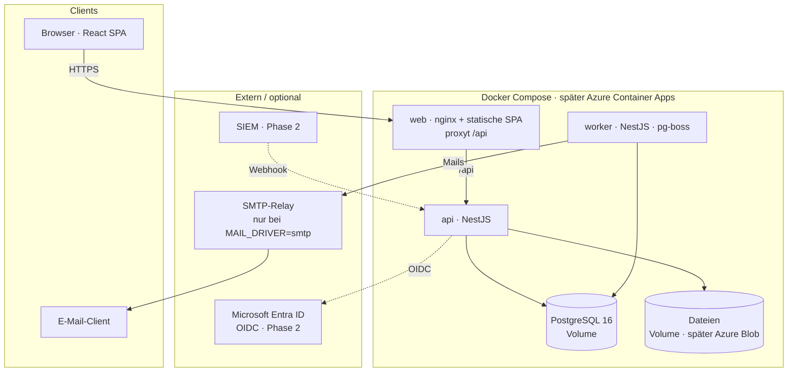
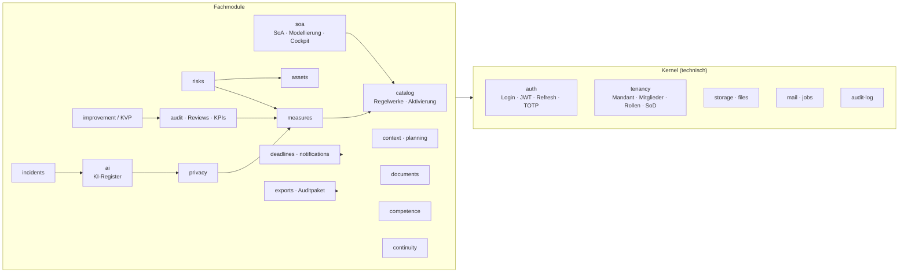

# 02 — Backend- und Systemarchitektur

> Status: **Freigegeben (2026-09-15)** · fortgeschrieben auf den Umsetzungsstand vom 2026-10-10.
> Was noch Plan ist, steht ausdrücklich als „geplant“ da — der Rest beschreibt den Code, wie er ist.

---

## 1. Architekturentscheidungen (ADR-Kurzform)

| #   | Entscheidung                                                                                     | Begründung                                                                                                                                                                                     | Verworfen                                                            |
| --- | ------------------------------------------------------------------------------------------------ | ---------------------------------------------------------------------------------------------------------------------------------------------------------------------------------------------- | -------------------------------------------------------------------- |
| 1   | **Modularer Monolith** (eine API, klar getrennte Module)                                         | KISS; ein Deployment, eine DB, eine Transaktion über Modulgrenzen (z. B. Vorfall → Meldefrist). Module sind so geschnitten, dass ein späteres Herauslösen möglich bleibt.                      | Microservices (Overhead ohne Nutzen bei diesem Mengengerüst)         |
| 2   | **PostgreSQL 16**, Open Source, im Container betrieben                                           | Vorgabe: keine Lizenz-/Zusatzkosten. RLS, `ltree`, generierte Spalten, SQL-Funktionen decken alle Anforderungen ab.                                                                            | CosmosDB (proprietär, nicht relational), Azure SQL (Lizenz im Preis) |
| 3   | **TypeScript End-to-End**: NestJS (API) + React/Vite (Web), pnpm-Monorepo                        | Ein Sprachraum, geteilte Typen/Validierung/Permission-Konstanten zwischen Front- und Backend.                                                                                                  | .NET (gut auf Azure, aber zweiter Sprachraum zu React)               |
| 4   | **Drizzle ORM** + SQL-Migrationen                                                                | Schema-as-Code in TS, generiert lesbares SQL; RLS, Trigger, Views und SQL-Funktionen stehen in `--custom`-Migrationen.                                                                         | Prisma (RLS/`SET LOCAL` und Views nur umständlich)                   |
| 5   | **pg-boss** als Job-Queue (Postgres-basiert)                                                     | Tägliche Wiedervorlage per Mail — ohne zusätzlichen Redis-Dienst; der Zeitplan ist eine Tabelle und übersteht Neustarts.                                                                       | BullMQ + Redis (weitere Komponente, weitere Kosten)                  |
| 6   | **Auth-Provider-Abstraktion**: lokal (Argon2 + JWT) zuerst, Entra ID (OIDC) als zweiter Provider | Vorgabe „hybrid“. Beide münden in dieselbe `user`/`tenant_membership`-Struktur. Entra ID ist **Phase 2**.                                                                                      | Nur SSO (blockiert Onboarding kleiner Mandanten)                     |
| 7   | **`StorageService` mit Treibern** (umgesetzt: `local`; Azure Blob als zweiter Treiber geplant)   | Dateien nie in Postgres. Die Schnittstelle hat bewusst drei Methoden, damit ein Blob-Treiber nur diese füllen muss.                                                                            | MinIO als Pflichtdienst (weitere Komponente ohne Nutzen im Kleinen)  |
| 8   | **REST + OpenAPI** (kein GraphQL)                                                                | Einfach, cachebar, Auditor-freundliche Exporte. Swagger-UI unter `/api/docs`.                                                                                                                  | GraphQL (Autorisierung pro Feld komplexer, kein Mehrwert)            |
| 9   | **Druckfertiges HTML** statt server-seitiger PDF-Erzeugung                                       | Das Dokument ist HTML mit A4-Druckstil; „Als PDF drucken“ im Browser ersetzt headless Chromium und jede PDF-Lizenz. Jeder Mandantenwert läuft durch `escapeHtml`, die Antwort trägt eine CSP.  | headless Chromium (schwerer Container), PDF-Bibliotheken (Lizenzen)  |
| 10  | **Docker Compose** heute, Azure Container Apps als Ziel                                          | Dieselben Images lokal und produktiv; `docker compose up -d --build` startet postgres, migrate, api, worker, web. Bicep für Azure ist **geplant**.                                             | App Service (teurer für mehrere Container), AKS (Overkill)           |
| 11  | **Eine Umfangsregel in SQL**: `requirement_in_scope(tenant, requirement)`                        | IT-Grundschutz-Modellierung, Adressat (NIS2/DSGVO an Mitgliedstaaten) und KI-Register entscheiden an genau einer Stelle, was zählt — SoA, Abdeckung, Kennzahl, Export, Cockpit, Auditprogramm. | Filter je Abfrage (driften auseinander)                              |

---

## 2. Systemkontext



**Gleicher Ursprung ist Pflicht, nicht Bequemlichkeit:** Das Refresh-Cookie ist `SameSite=strict`, deshalb
liefert nginx die SPA aus und leitet `/api` an die API weiter.

**Kosten-Fußabdruck:** ausschließlich Open Source. Mail-Treiber `log` (Standard) stellt nichts zu — die
Anwendung läuft ohne SMTP-Entscheidung, ohne Zugangsdaten, ohne Kosten.

> **Trade-off, den wir bewusst eingehen:** Selbst betriebenes Postgres bedeutet, dass Backups und Updates uns
> gehören. Die Datensicherung ist in [`../deployment.md`](../deployment.md) beschrieben; ein Wechsel auf
> „Azure Database for PostgreSQL Flexible Server“ bleibt ein Connection-String-Wechsel.

---

## 3. Repository-Struktur (Monorepo)

```
ISMS_SaaS/
├─ apps/
│  ├─ api/                 NestJS · REST-API und Hintergrundprozess (src/main.ts, src/worker.ts)
│  │  ├─ src/kernel/       auth · tenancy · db · audit-log · storage · mail · jobs · http
│  │  └─ src/modules/      catalog · soa · measures · context · assets · risks · documents
│  │                       competence · audit · improvement · incidents · continuity · privacy
│  │                       ai · files · deadlines · notifications · dashboard · exports · auditlog
│  └─ web/                 React 18 + Vite + TailwindCSS · TanStack Query · React Router · Recharts
├─ packages/
│  ├─ db/                  Drizzle-Schema, SQL-Migrationen, RLS/Trigger/Funktionen, Seeds
│  ├─ shared/              Zod-DTOs, Enums, Permission-Katalog, Policy-Helper, Beschriftungen, KI-Einstufung
│  └─ catalog/             Kataloge als JSON (ISO 27001, BSI, NIS2, DSGVO, AI Act) + Crosswalk
├─ infra/docker/           Dockerfile (Targets api, web), nginx.conf, Entwicklungs-Compose
├─ docker-compose.yml      Gesamtsystem: postgres · migrate · api · worker · web (+ mailpit als Profil)
├─ docs/                   architecture/, context/, produkt-screenshots/, technik.md, deployment.md
└─ .github/workflows/      ci.yml (install · build · typecheck · lint · format · test)
```

Tooling: pnpm Workspaces (`pnpm -r build` in der Abhängigkeitsreihenfolge), Prettier, Vitest (Unit und
Integration gegen echtes PostgreSQL mit RLS), Playwright für die Produkt-Screenshots.

---

## 4. Modulschnitt der API



**Regeln für Modulgrenzen:**

- Fachmodule greifen auf andere Fachmodule nur über deren öffentliche Services zu (`RisksService.linkMeasure()`),
  nie über Internals.
- Was über Modulgrenzen hinweg gilt, steht in der Datenbank, nicht in Ereignissen: `requirement_in_scope()`,
  `requirement_check_status()`, Trigger für die Funktionstrennung, generierte Spalten (Risiko-Score,
  KI-Risikoklasse). So kann keine zweite Abfrage eine eigene Variante der Regel pflegen.
- Jedes Modul: `*.controller.ts` (HTTP, Zod-Validierung, `@RequirePermission`) → `*.service.ts` (Fachlogik,
  Policy-Checks, Transaktion, Drizzle/SQL). Kein Fachcode im Controller. Eine eigene Repository-Schicht gibt es
  bewusst nicht — sie wäre bei dieser Größe eine Weiterleitung ohne Inhalt.

---

## 5. Request-Pipeline & Sicherheit

```mermaid
sequenceDiagram
  participant C as Client
  participant G as Guards
  participant S as Service
  participant DB as PostgreSQL (RLS)

  C->>G: GET /api/v1/risks/123 · Bearer JWT
  G->>G: JwtGuard – Signatur, Ablauf
  G->>G: TenantContext – membership_id, tenant_id, person_id, pv aus Token
  G->>G: PermissionGuard – @RequirePermission('risk.read')<br/>Cache-Lookup, bei pv-Mismatch DB-Refresh
  G->>S: ctx + params
  S->>DB: BEGIN; set_config('app.tenant_id', ctx.tenant_id, true)
  S->>DB: SELECT … FROM risk WHERE id = $1
  DB-->>S: Zeile (nur wenn tenant_id passt – RLS)
  S->>S: assertCan(ctx, 'risk.write_own', risk)
  S->>DB: COMMIT
  S-->>C: 200 · DTO
```

| Aspekt                         | Umsetzung                                                                                                                                                                                                                                                                            |
| ------------------------------ | ------------------------------------------------------------------------------------------------------------------------------------------------------------------------------------------------------------------------------------------------------------------------------------ |
| **Authentifizierung lokal**    | Argon2id-Hash, Access-JWT (Authorization-Header), Refresh-Token als `httpOnly`/`SameSite=Strict`-Cookie mit Rotation und Reuse-Detection (20 s Kulanzfenster für parallel startende Tabs). Optional TOTP-MFA.                                                                        |
| **Authentifizierung Entra ID** | **Phase 2.** `openid-client` (Authorization-Code + PKCE) hinter derselben Provider-Abstraktion; Erstlogin legt `user` mit `auth_provider = 'entra'` an.                                                                                                                              |
| **Autorisierung**              | `@RequirePermission()`-Decorator + Guard (siehe `01-datenmodell.md` §4.3); Ownership-Scoping via `assertCan()`; DB-Trigger als zweite Verteidigungslinie für die Funktionstrennung.                                                                                                  |
| **Mandantenisolation**         | Jede Transaktion setzt `app.tenant_id`; App-Rolle `isms_app` ohne `BYPASSRLS`; neue Tabellen bekommen ihre Policy in der Migration (zuletzt `tenant_module`, `ai_system`).                                                                                                           |
| **Validierung**                | Zod-Schemas in `packages/shared`, in der API über `ZodPipe`. Die Oberfläche importiert `@isms/shared` nicht; was sie zur Anzeige spiegelt (Beschriftungen, KI-Einstufung), ist dort klein dupliziert und per Test gegen die API abgesichert.                                         |
| **Härtung**                    | Helmet, strikte CORS, Upload-Allowlist ohne SVG/HTML, Größenlimits, Downloads immer als Anhang mit `nosniff` und Sandbox-CSP. **Geplant:** Rate-Limit für Login, Virus-Scan-Hook.                                                                                                    |
| **Audit-Log**                  | Interceptor schreibt bei jedem erfolgreichen ändernden Request die übermittelte Anfrage, dazu Logins und Exporte. Append-only (`UPDATE`/`DELETE` entzogen). Feldgenaue Historie liegt in den Fachmodulen (Dokumentfassungen, Risikobewertungen, eingefrorene Managementbewertungen). |
| **Secrets**                    | `.env` lokal; Compose-Variablen mit Präfix `ISMS_`. In Azure als Container-App-Secrets.                                                                                                                                                                                              |

---

## 6. Hintergrundjobs (pg-boss)

| Job / Ablauf    | Trigger             | Aufgabe                                                                                                       |
| --------------- | ------------------- | ------------------------------------------------------------------------------------------------------------- |
| Tägliche Digest | `DIGEST_CRON`       | Wiedervorlage aus der `/deadlines`-Abfrage, je verantwortlicher Person gruppiert, per `MailService`           |
| Katalog-Seed    | Deploy (`migrate`)  | idempotentes Einspielen der Kataloge und des Crosswalks; geänderte Systemrollen erhöhen `permissions_version` |
| Kennzahlen      | bei Abruf / Refresh | berechnete KPIs (`kpi.source = 'computed'`) — eine Abfrage je `computation_key`                               |

Worker und API sind dasselbe Docker-Image mit unterschiedlichem Entry-Point (`node dist/main.js` vs.
`node dist/worker.js`, gesteuert durch `JOBS_ENABLED`). pg-boss legt sein eigenes Schema an und verbindet sich
deshalb als `isms_migrator`; Fachdaten liest der Worker weiterhin als `isms_app` unter RLS.

**Geplant:** nächtlicher `pg_dump` als Job, Erinnerungen vor Fristablauf (T-7/T-1) als eigene Benachrichtigung.

---

## 7. API-Design

- Basis `/api/v1`, Ressourcen im Plural, mandantenlos in der URL (Mandant kommt aus dem Token; Wechsel per
  `POST /auth/switch-tenant`).
- Listen: `?page&size&q`; Antwort `{ items, total, page, size }`.
- Fehlerformat: RFC 9457 Problem Details; Verstöße gegen die Funktionstrennung `409` mit `type: …/sod-violation`;
  blockierende Fachprüfungen (VVT, BIA, KI-Register) `400` mit allen offenen Punkten in `detail`.
- Swagger-UI aus den Decorators unter `/api/docs`.
- Kern-Endpunkte:
  - `GET /frameworks` · `POST /frameworks/activate` · `DELETE /frameworks/:key/activate`
  - `GET /soa?framework=…` · `PATCH /soa/:requirementId` (Anwendbarkeit, Reife)
  - `GET /modeling?framework=BSI_GS` · `PATCH /modeling/variant` · `PUT|DELETE /modeling/modules/:id` ·
    `POST /modeling/baseline` — IT-Grundschutz-Modellierung
  - `GET /coverage-map?framework=NIS2|EU_AI_ACT` · `GET /coverage-map/flow?framework=…` — Cockpit
  - `POST /measures/:id/requirements` `{ requirementId }` → Antwort enthält `suggestions[]` aus dem Crosswalk
  - `GET /dashboard/coverage` · `GET /dashboard/traceability/asset/:id`
  - `GET|POST /ai-systems` · `PATCH /ai-systems/:id` — KI-Register (nur Betreiber)
  - `POST /incidents/:id/confirm-breach` · `…/mark-significant` · `…/mark-ai-serious` → Meldefristen
  - `GET /exports/audit-package.zip` — das ganze ISMS in einer Datei

---

## 8. Frontend-Leitlinien (Kurzfassung)

- **Layout:** dunkle Navigationsspalte links mit eigenen Abschnitten (Überblick, Managementsystem,
  Anforderungen & Maßnahmen, Risiken, Vorfälle & Notbetrieb, Datenschutz & KI, Prüfung & Verbesserung,
  Verwaltung); Inhaltsspalte mit Kennzahl-Kacheln → Liste → Detailfenster.
- **State:** Server-State ausschließlich über TanStack Query; kein globaler Client-Store außer Auth/Mandant.
- **Formulare:** schlicht, `FormData` oder lokaler State; die Validierung entscheidet die API (Zod).
- **Charts:** Recharts (Radar, Balken); 5×5-Risikomatrix als Tabelle; das Cockpit-Flussdiagramm als eigenes
  SVG mit festen Spalten.
- **Normbezug:** jedes Feld trägt eine Kurzhilfe (`NormHint`) mit Regelwerk, Kapitel und Kurztitel — erzeugt aus
  `packages/catalog/data`, mit BSIG-Fundstelle bei NIS2.
- **Sprache:** Deutsch; Fachbegriffe aus dem Katalog kommen aus der DB, Aufzählungswerte aus `lib/labels.ts`.

---

## 9. Umgebungen & Betrieb

|             | Lokal (Entwicklung)                                                | Docker Compose (Demo/Betrieb)                | Azure (geplant)                      |
| ----------- | ------------------------------------------------------------------ | -------------------------------------------- | ------------------------------------ |
| Start       | `infra/docker/docker-compose.yml` (postgres, mailpit) + `pnpm dev` | `docker compose up -d --build`               | Bicep → Container Apps Environment   |
| DB          | Container                                                          | Container, Volume                            | Container + Files-Volume oder Flex   |
| Dateien     | lokales Verzeichnis                                                | Volume `files`                               | Azure Blob (zweiter Storage-Treiber) |
| Mail        | Treiber `log` oder Mailpit                                         | `log`, wahlweise SMTP                        | SMTP-Relay des Kunden                |
| CI          | GitHub Actions: install · build · typecheck · lint · format · test | —                                            | Image-Build und Deploy               |
| Migrationen | `pnpm db:migrate`                                                  | einmaliger `migrate`-Container vor API-Start | Init-Container                       |

Details zu Inbetriebnahme, Datensicherung und Updates: [`../deployment.md`](../deployment.md).

---

## 10. Umsetzungsstand

Umgesetzt, jeweils mit Migrationen, API, Oberfläche und Tests:

1. **Fundament:** Monorepo, Drizzle-Schema, RLS-/Trigger-Migrationen, Seeds mit ISO-27001-Katalog (Referenz +
   Kurztitel), BSI-Kompendium, NIS2, DSGVO und Crosswalk.
2. **Identity & Tenancy:** lokaler Login, JWT/Refresh mit Reuse-Detection, Rollen/Permissions, SoD-Regeln,
   Einladungen, Audit-Log.
3. **Mapping-Kern:** Regelwerke aktivieren, SoA, Maßnahmen mit Mehrfachzuordnung und Crosswalk-Vorschlägen,
   Abdeckung auf der Startseite.
4. **IT-Grundschutz:** Absicherungsvariante, Modellierung, IT-Grundschutz-Check statt SoA.
5. **Assets & Risiken:** Inventar, eine Bewertung „Risiko heute“ auf der 5×5-Matrix, Behandlung, Übernahme im
   Vier-Augen-Prinzip, Historie.
6. **Dokumente & Kompetenz:** Fassungen, Freigabe, Lesebestätigung, Kompetenzprofile, Schulungen.
7. **Audit & KVP:** Auditprogramm nach Kapiteln, Feststellungen mit Nachweis, Korrekturmaßnahmen,
   Managementbewertung in drei Schritten, Kennzahlen.
8. **Betrieb:** Vorfälle mit Meldefristen (DSGVO, NIS2, AI Act), Playbooks, Ursachenanalyse, BIA und Notfallpläne.
9. **Datenschutz & KI:** Verarbeitungsverzeichnis mit Prüfungen, TOM aus dem ISMS, DSFA; KI-Register mit
   Betreiberpflichten nach dem AI Act.
10. **NIS2:** nur Pflichten der Einrichtung, BSIG-Fundstellen, Cockpit mit indirekter Abdeckung und Flussdiagramm.
11. **Querschnitt:** Wiedervorlage und tägliche Mail, Exporte und Auditpaket, Docker-Compose-Deployment.

Offen bzw. Phase 2: Entra-ID-Provider, Azure-Deployment (Bicep, Blob-Treiber), Rate-Limit, Lieferantenmodul,
Betroffenenanfragen (DSAR), SIEM-Anbindung. Einzelne Prüfaufträge stehen in [`../offene-punkte.md`](../offene-punkte.md).
