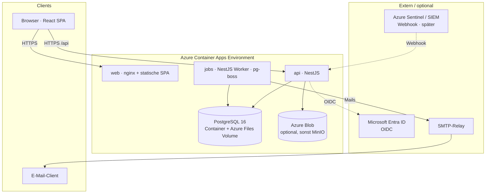
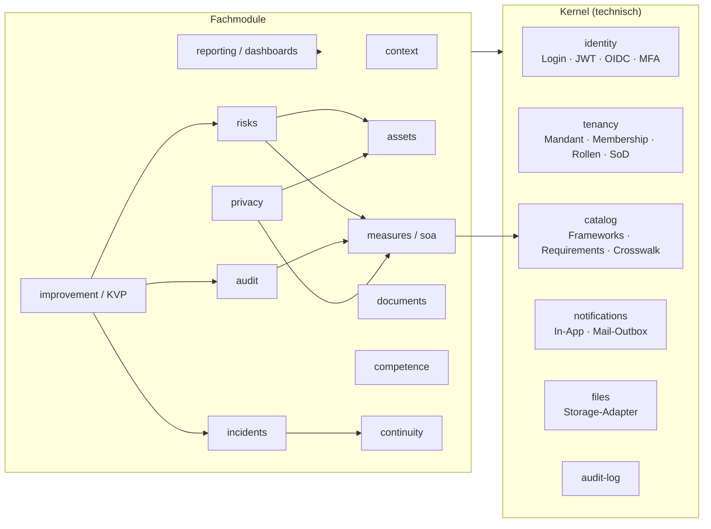

# 02 — Backend- und Systemarchitektur

> Status: **Freigegeben (2026-09-15)** · Stand: 2026-09-15

---

## 1. Architekturentscheidungen (ADR-Kurzform)

| # | Entscheidung | Begründung | Verworfen |
|---|---|---|---|
| 1 | **Modularer Monolith** (eine API, klar getrennte Module) | KISS; ein Deployment, eine DB, eine Transaktion über Modulgrenzen (z. B. Incident → Meldefrist → Notification). Module sind so geschnitten, dass ein späteres Herauslösen möglich bleibt. | Microservices (Overhead ohne Nutzen bei diesem Mengengerüst) |
| 2 | **PostgreSQL 16**, Open Source, im Container betrieben | Vorgabe: keine Lizenz-/Zusatzkosten. RLS, `ltree`, generierte Spalten, `tsvector` decken alle Anforderungen ab. | CosmosDB (proprietär, nicht relational), Azure SQL (Lizenz im Preis) |
| 3 | **TypeScript End-to-End**: NestJS (API) + React/Vite (Web), pnpm-Monorepo | Ein Sprachraum, geteilte Typen/Validierung/Permission-Konstanten zwischen Front- und Backend. | .NET (gut auf Azure, aber zweiter Sprachraum zu React) |
| 4 | **Drizzle ORM** + SQL-Migrationen | Schema-as-Code in TS, generiert lesbares SQL, keine Magie; `SET LOCAL` für RLS und Trigger/Views sind problemlos in Migrationen ausdrückbar. | Prisma (RLS/`SET LOCAL` und Views nur umständlich) |
| 5 | **pg-boss** als Job-Queue (Postgres-basiert) | Fristen-Erinnerungen, KPI-Berechnung, Mail-Versand — ohne zusätzlichen Redis-Dienst. | BullMQ + Redis (weitere Komponente, weitere Kosten) |
| 6 | **Auth-Provider-Abstraktion**: lokal (Argon2 + JWT) zuerst, Entra ID (OIDC) als zweiter Provider | Vorgabe „hybrid“. Beide münden in dieselbe `user`/`tenant_membership`-Struktur. | Nur SSO (blockiert Onboarding kleiner Mandanten) |
| 7 | **Storage-Adapter** (lokal/MinIO in Dev, Azure Blob in Prod, optional) | Dateien nie in Postgres; Azure Blob kostet Cent-Beträge und ist austauschbar. | — |
| 8 | **REST + OpenAPI** (kein GraphQL) | Einfach, cachebar, generierbarer Client, Auditor-freundliche Exporte. | GraphQL (Autorisierung pro Feld komplexer, kein Mehrwert) |
| 9 | **Server-seitige PDF-Erzeugung** über headless Chromium aus denselben React-Report-Views | Ein Rendering-Pfad für Bildschirm und PDF (SoA, Risikobericht, Playbook, Notfallkarte). | pdfmake/eigene Layout-Engine (doppelte Pflege) |
| 10 | **Azure Container Apps** (Consumption) als Ziel-Runtime | Scale-to-Zero, Docker-native, gleiche Images wie lokal. | App Service (teurer für mehrere Container), AKS (Overkill) |

---

## 2. Systemkontext



**Kosten-Fußabdruck:** Postgres, API, Worker und Web laufen als Container. Consumption-Tarif (Scale-to-Zero) + ein kleines Azure-Files-Volume für Postgres. Managed-Dienste sind ausschließlich optional (Blob, Entra ID ist bei M365-Kunden vorhanden). Lokal: `docker compose up` startet identische Images inkl. Mailpit (Mail-Fake) und MinIO.

> **Trade-off, den wir bewusst eingehen:** Selbst betriebenes Postgres bedeutet, dass Backups und Updates uns gehören. Der Worker führt daher ein nächtliches `pg_dump` ins Blob/Volume aus (Aufbewahrung 30 Tage), und die Migration auf „Azure Database for PostgreSQL Flexible Server“ (Burstable, ~12 €/Monat) bleibt ein reiner Connection-String-Wechsel, wenn das Betriebsrisiko irgendwann teurer wird als der Dienst.

---

## 3. Repository-Struktur (Monorepo)

```
ISMS_SaaS/
├─ apps/
│  ├─ api/                 NestJS · REST-API + Jobs (gleiche Codebasis, zwei Entry-Points)
│  │  └─ src/modules/      identity · tenancy · catalog · context · assets · risks · measures
│  │                       documents · competence · audit · improvement · incidents
│  │                       continuity · privacy · reporting · integrations · notifications
│  └─ web/                 React 18 + Vite + TailwindCSS + shadcn/ui · TanStack Query/Router
├─ packages/
│  ├─ db/                  Drizzle-Schema, SQL-Migrationen, RLS-/Trigger-Helfer, Seed-Runner
│  ├─ shared/              Zod-DTOs, Enums, Permission-Katalog, Policy-Helper (`can()`), i18n-Keys
│  └─ catalog/             Framework-Seeds als JSON (ISO, BSI, NIS2, DSGVO, Crosswalk)
├─ infra/
│  ├─ docker/              Dockerfiles, docker-compose.yml (dev), compose.prod.yml
│  └─ azure/               Bicep: Container Apps Env, Files-Volume, Blob (optional)
├─ docs/                   architecture/, context/, screenshots/
└─ .github/workflows/      ci.yml (lint · typecheck · test · migration-check · build) · deploy.yml
```

Tooling: pnpm Workspaces + Turborepo (Build-Cache), ESLint + Prettier, Vitest (Unit/Integration), Playwright (E2E, Chromium bereits vorhanden), Testcontainers-Postgres für Integrationstests mit echtem RLS.

---

## 4. Modulschnitt der API



**Regeln für Modulgrenzen (werden per ESLint-Boundary-Regel erzwungen):**

- Fachmodule importieren nur aus `kernel/*` und `packages/shared`, nie gegenseitig aus Internals. Querbezüge laufen über öffentliche Service-Interfaces (`RisksService.linkMeasure()`) oder **Domain-Events**.
- Domain-Events (in-process, NestJS `EventEmitter2`, synchron in derselben Transaktion oder als pg-boss-Job wenn asynchron sinnvoll): `incident.breach_confirmed` → `reporting_obligation`-Zeilen anlegen + Notification; `measure.status_changed` → Coverage-Cache invalidieren; `document_version.published` → Acknowledgement-Kampagne starten; `finding.created` → KVP-Vorschlag.
- Jedes Modul hat dieselbe innere Struktur: `*.controller.ts` (HTTP, DTO-Validierung) → `*.service.ts` (Fachlogik, Policy-Checks, Transaktionen) → `*.repository.ts` (Drizzle-Queries). Kein Fachcode im Controller, kein SQL im Service.

---

## 5. Request-Pipeline & Sicherheit

```mermaid
sequenceDiagram
  participant C as Client
  participant G as Guards
  participant S as Service
  participant DB as PostgreSQL (RLS)

  C->>G: GET /api/v1/risks/123 · Bearer JWT
  G->>G: JwtGuard – Signatur, Ablauf
  G->>G: TenantContext – membership_id, tenant_id, person_id, pv aus Token
  G->>G: PermissionGuard – @RequirePermission('risk.read')<br/>Cache-Lookup, bei pv-Mismatch DB-Refresh
  G->>S: ctx + params
  S->>DB: BEGIN; SET LOCAL app.tenant_id = ctx.tenant_id
  S->>DB: SELECT … FROM risk WHERE id = $1
  DB-->>S: Zeile (nur wenn tenant_id passt – RLS)
  S->>S: can(ctx, 'risk.write_own', risk) für Aktions-Flags
  S->>DB: COMMIT
  S-->>C: 200 · DTO inkl. `_actions: ['edit','accept']`
```

| Aspekt | Umsetzung |
|---|---|
| **Authentifizierung lokal** | Argon2id-Hash, Access-JWT 15 min (Authorization-Header), Refresh-Token 30 Tage als `httpOnly`/`SameSite=Strict`-Cookie mit Rotation und Reuse-Detection. Optional TOTP-MFA (`user.totp_secret`). |
| **Authentifizierung Entra ID** | `openid-client` (Authorization-Code + PKCE). `tenant.sso_config` (Issuer, Client-ID, Secret verschlüsselt) → Login-Flow `/auth/sso/:tenantSlug`. Erstlogin legt `user` mit `auth_provider = 'entra'` + `external_subject` an; Membership-Zuweisung per Einladung oder Domänen-Regel (`settings.sso_auto_join_domains`). SAML ist über denselben `AuthProvider`-Vertrag nachrüstbar (z. B. `@node-saml/passport-saml`), wird aber erst umgesetzt, wenn ein Kunde es braucht. |
| **Autorisierung** | `@RequirePermission()`-Decorator + Guard (siehe `01-datenmodell.md` §4.3); Ownership-Scoping via `can()` aus `packages/shared`; DB-Trigger als zweite Verteidigungslinie für SoD. |
| **Mandantenisolation** | Jede Transaktion `SET LOCAL app.tenant_id`; App-DB-Rolle ohne `BYPASSRLS`; Integrationstests prüfen explizit „Tenant A sieht keine Zeile von B“. |
| **Validierung** | Zod-Schemas in `packages/shared` — identisch in Formularen (react-hook-form) und API (NestJS-Pipe). |
| **Härtung** | Helmet, Rate-Limit (Login, Passwort-Reset), CSRF-Token für Cookie-Endpunkte, strikte CORS, Upload-Whitelist (MIME + Magic Bytes), Größenlimits, Virus-Scan-Hook (ClamAV optional). |
| **Audit-Log** | Interceptor schreibt bei jedem mutierenden Request `(actor, tenant, entity, action, diff)`; Diff aus `before/after` im Service. Tabelle append-only. |
| **Secrets** | `.env` lokal; in Azure als Container-App-Secrets (kostenlos). Key Vault optional. Integrations-Secrets in DB mit `pgcrypto` + App-Master-Key. |

---

## 6. Hintergrundjobs (pg-boss)

| Job | Trigger | Aufgabe |
|---|---|---|
| `deadlines.scan` | alle 15 min | `reporting_obligation`, `document.next_review_at`, `action.due_at`, `risk.next_review_at`, `person_skill.valid_until` → Notifications (T-7, T-1, überfällig) |
| `kpi.compute` | täglich 02:00 | berechnete KPIs (`kpi.source = 'computed'`) → `kpi_value` |
| `mail.send` | bei Notification | Outbox → SMTP, Retry mit Backoff |
| `acknowledgement.expand` | Event | Kampagnen-Zielgruppe in `acknowledgement`-Zeilen auflösen; Nachzügler täglich |
| `catalog.seed` | Deploy / manuell | idempotentes Einspielen der Framework-JSONs |
| `backup.pg_dump` | täglich 03:00 | Dump ins Blob/Volume, Retention 30 Tage |
| `report.render` | on demand | PDF via headless Chromium (Report-Route der SPA mit Service-Token) |

Worker und API sind dasselbe Docker-Image mit unterschiedlichem Entry-Point (`node dist/main.js` vs. `node dist/worker.js`) — ein Build, zwei Container-Apps.

---

## 7. API-Design

- Basis `/api/v1`, Ressourcen im Plural, mandantenlos in der URL (Mandant kommt aus dem Token; Wechsel per `POST /auth/switch-tenant`).
- Listen: `?page&size&sort&q&filter[status]=…`; Antwort `{ items, total, page }`. Export derselben Filter als CSV/XLSX über `Accept`-Header.
- Jede Detail-Antwort enthält `_actions` (vom `can()`-Helper berechnet) — die UI blendet Buttons danach ein, ohne Rechte-Logik zu duplizieren.
- Fehlerformat: RFC 9457 Problem Details; SoD-Verstöße `409` mit `type: …/sod-violation`.
- OpenAPI-Spec wird aus Decorators generiert; daraus entsteht der typisierte Frontend-Client (`openapi-typescript`).
- Beispiel-Endpunkte für den Mapping-Kern:
  - `GET  /frameworks` · `POST /frameworks/:id/activate`
  - `GET  /soa?framework=ISO27001` (Query 3.3a) · `PATCH /soa/:requirementId` (Anwendbarkeit, Reife)
  - `POST /measures/:id/requirements` `{ requirementId }` → Antwort enthält `suggestions[]` (Query 3.3c)
  - `GET  /dashboard/coverage` (Query 3.3b) · `GET /assets/:id/traceability` (Query 3.3d)
  - `POST /incidents/:id/confirm-breach` → erzeugt Meldefristen · `POST /incidents/:id/playbook-steps/:stepId/done`

---

## 8. Frontend-Leitlinien (Kurzfassung)

- **Layout** analog Referenz: schmale Modul-Leiste links, Kontext-Navigation je Modul, Inhaltsspalte mit KPI-Kacheln → Filter → Liste/Detail. Fokus-Wechsel (aktives Framework) in der Kopfzeile.
- **State:** Server-State ausschließlich über TanStack Query; kein globaler Client-Store außer Auth/Tenant-Kontext.
- **Formulare:** react-hook-form + Zod-Schemas aus `packages/shared`.
- **Charts:** Recharts (Spider/Radar, Donut, Balken, 5×5-Heatmap als CSS-Grid).
- **i18n:** `de` als Default, `en` vorbereitet (react-i18next); Fachbegriffe aus dem Katalog kommen aus der DB.
- **Barrierefreiheit/Theme:** shadcn/ui-Komponenten (Radix-basiert), Light/Dark über CSS-Variablen.

---

## 9. Umgebungen & Betrieb

| | Lokal (Dev) | Azure (Prod) |
|---|---|---|
| Start | `docker compose up` (postgres, minio, mailpit) + `pnpm dev` | Bicep → Container Apps Env, 4 Apps (web, api, jobs, postgres) |
| DB | Container, Volume | Container, Azure Files Volume, nächtlicher Dump |
| Dateien | MinIO (S3-API) | Azure Blob (optional) oder MinIO-Container |
| Mail | Mailpit UI | SMTP-Relay des Kunden / kostenloser Tarif |
| Logs | pino → stdout | stdout → Container Apps Logs (Basis-Tarif kostenlos) |
| CI/CD | GitHub Actions: lint · typecheck · vitest · migration-dry-run · docker build | Tag → Image ins GHCR → `az containerapp update` |
| Migrationen | `pnpm db:migrate` (drizzle-kit) | Init-Container vor API-Start |

---

## 10. Umsetzungsreihenfolge nach Freigabe

1. **Fundament:** Monorepo, Docker-Compose, Drizzle-Schema aus `01-datenmodell.md`, RLS-/Trigger-Migrationen, Seed-Runner mit ISO-27001-Katalog (Ref + Titel) und BSI-Crosswalk.
2. **Identity & Tenancy:** lokaler Login, JWT/Refresh, Rollen/Permissions, SoD-Regeln, Einladungen, Audit-Log-Interceptor.
3. **Mapping-Kern:** Frameworks aktivieren, SoA-View, Maßnahmen + Multi-Mapping mit Crosswalk-Vorschlägen, Dashboard-Coverage.
4. **Assets & Risiken:** Inventar, 5×5-Matrix, Behandlungsplan, Restrisiko-Übernahme, Historie.
5. **Dokumente & Kompetenz:** Versionen, Freigabe (4-Augen), Lesebestätigung, Kompetenzregister, Schulungen.
6. **Audit & KVP:** Audits, Findings, Actions, Management-Review, KPIs.
7. **Betrieb:** Incidents, Meldefristen (DSGVO/NIS2), Playbooks, RCA, BIA/BCP.
8. **Datenschutz:** VVT, TOM-Mapping, DSFA.
9. **Entra-ID-Provider, Reports/PDF, Azure-Deployment.**

Jeder Schritt endet mit lauffähiger Software (Migrationen + API + UI + Tests) — kein „Big Bang“.
